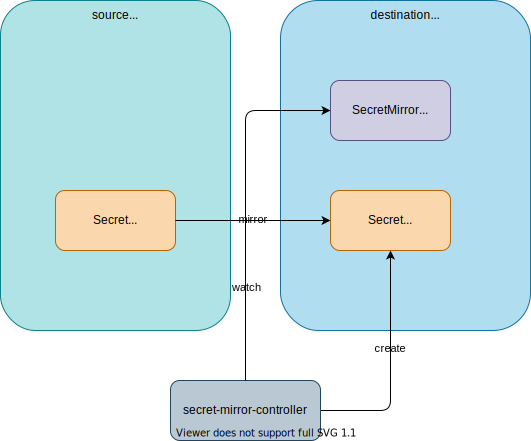

# Secret Mirror Operator

This kubebuilder-based Kubernetes operator copies a `Secret` to another namespace and synchronizes it with the custom resource `SecretMirror`.



## Reconciliation Logic

1. Get `SecretMirror` from request.
2. If `SecretMirror` doesn't exist, just finish the reconciliation. If error occurs, retry later.
3. Get `Secret` (**fromSecret**) with `SecretMirror`'s name from `fromNamespace` `Namespace`.
4. If `Secret` (**fromSecret**) doesn't exist, delete the corresponding `Secret` (**toSecret**) if exists. If error occurs, retry later.
5. Create `toSecret` if not exists.
6. Check if `toSecret` is managed by secret-mirror-controller.
7. Update `toSecret` data if data is changed.

## Getting Started
1. Install `secret-mirror-operator`.
    ```
    kubectl apply -k github.com/bebit/secret-mirror-operator/config/default
    ```
1. Create `src` and `dst` namespace.
    ```bash
    kubectl apply -f config/samples/namespace-dst.yaml,config/samples/namespace-src.yaml
    ```
1. Create `Secret` in `src` namespace.
    ```bash
    kubectl apply -f config/samples/secret.yaml
    ```
1. Create `SecretMirror` in `dst` namespace.
    ```bash
    kubectl apply -f config/samples/secret_v1alpha1_secretmirror.yaml
    ```
    ```yaml
    apiVersion: secret.bebit.com/v1alpha1
    kind: SecretMirror
    metadata:
      name: secret
      namespace: dst
    spec:
      fromNamespace: src
    ```
1. Check `Secret` in `dst` namespace.
    ```bash
    kubectl get secret secret -n dst -o yaml
    ```

    ```yaml
    apiVersion: v1
    data:
      foo: YmFy
    kind: Secret
    metadata:
      creationTimestamp: "2021-12-30T01:14:26Z"
      name: secret
      namespace: dst
      ownerReferences:
      - apiVersion: secret.bebit.com/v1alpha1
        blockOwnerDeletion: true
        controller: true
        kind: SecretMirror
        name: secret
        uid: f1709c26-6497-40b5-84a7-da13c38cf05f
      resourceVersion: "41781"
      uid: 81452942-2562-4f14-be8b-e4c3c856cae6
    type: Opaque
    ```

## Behaviors

1. Change `Secret` in `dst` Namespace manually.

    ```
    kubectl patch secret secret -p "{\"data\":{\"manually\": \"$(echo updated | base64 -)\"}}" -n dst
    ```

    The controller keeps the Secret same as the original `Secret`.

    ```
    kubectl get secret secret -n dst -o jsonpath='{.data}'
    {"foo":"YmFy"}
    ```
1. Change `Secret` in `src` Namespace manually.
    ```
    kubectl patch secret secret -p "{\"data\":{\"srcSecret\": \"$(echo updated | base64 -)\"}}" -n src
    ```
    The controller keeps the Secret same as the original `Secret`.
    ```
    kubectl get secret secret -n dst -o jsonpath='{.data}'
    {"foo":"YmFy","srcSecret":"dXBkYXRlZAo="}
    ```
1. Delete `Secret` in `dst` Namespace.
    ```
    kubectl delete sercet dst -n dst
    ```
    The controller recreates the Secret.
    ```
    kubectl get secret secret -n dst -o jsonpath='{.data}'
    {"foo":"YmFy","srcSecret":"dXBkYXRlZAo="}
    ```
1. Delete `Secret` in `src` Namespace.
    ```
    kubectl delete secret secret -n src
    ```

    The controller deletes the Secret in `dst` Namespace.

    ```
    kubectl get secret -n dst
    NAME                  TYPE                                  DATA   AGE
    default-token-wwsmc   kubernetes.io/service-account-token   3      2m19s
    ```
1. Recreate `Secret` in `src` Namespace.
    ```
    kubectl apply -f config/samples/secret.yaml
    ```

    The controller creates a new Secret in `dst` Namespace.
    ```
    kubectl get secret secret -n dst -o jsonpath='{.data}'
    {"foo":"YmFy"}
    ```
